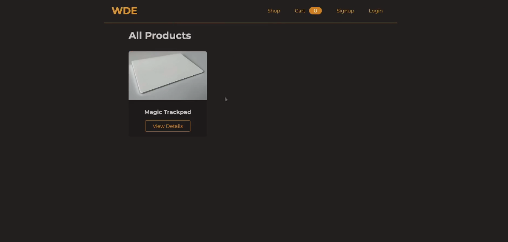

<h1 align="center">
    Web Development Essentials
</h1>

<nav>
  <ul style="list-style:none;display:flex;justify-content:center;gap:40px;">
    <li>
      <a href="#projeto">Projeto</a>
    </li>
    <li>
      <a href="#tecnologias">Tecnologias</a>
    </li>
  </ul>
</nav>

## 💻 Projeto

O projeto construído é uma loja completa, utilizando o padrão de Projetos MVC (Model, Views, Controller), onde podemos navegar, ver todas as ofertas, criar novas, editar e excluí-las, desta forma teremos um CRUD (Create, Read, Update, Delete) completo e muito mais.

Funcionalidades:
  - Autenticação;
  - Autorização,

Novas técnologias e funcionalidade:

- 11/23 - Introdução do arquivo .env, um gerenciador de informações sensíveis para desenvolvedores.

## 🚀 Tecnologias

Esse projeto foi desenvolvido com as seguintes tecnologias:

- [Node.js](https://nodejs.org/en/)
- [Express](https://expressjs.com/pt-br/)
- [MongoDB](https://www.mongodb.com/)
- [EJS](https://ejs.co/)
- [.ENV](https://www.dotenv.org/)
